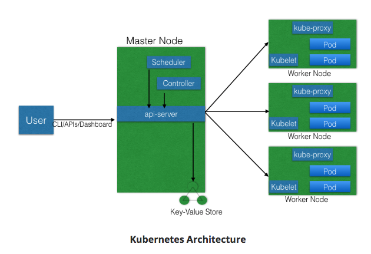
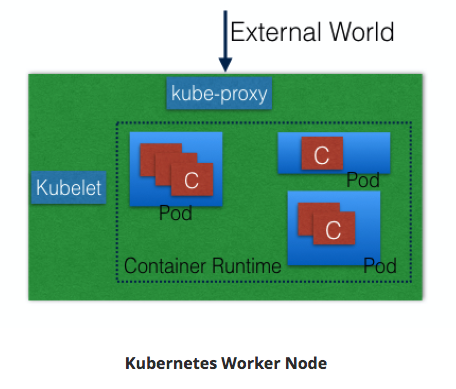
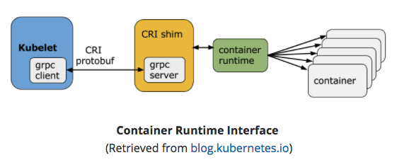
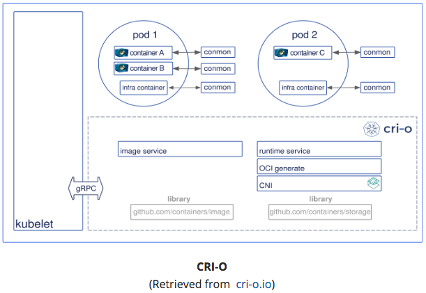
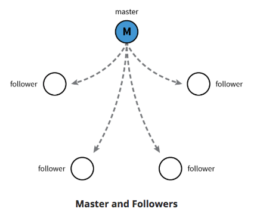
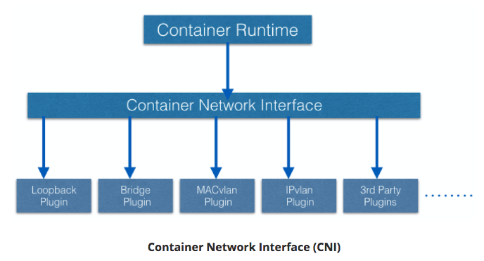
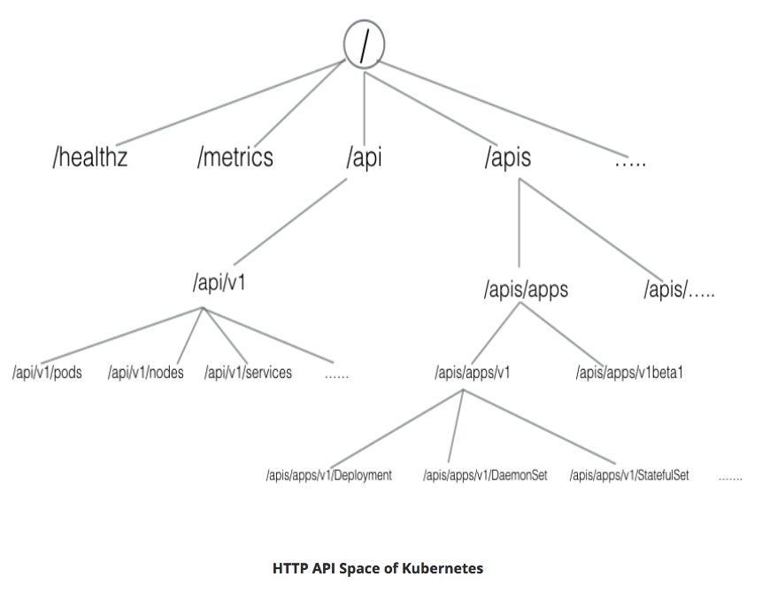
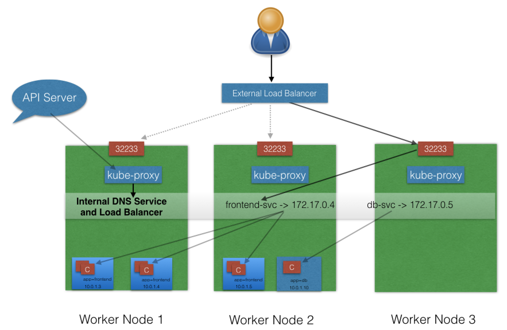
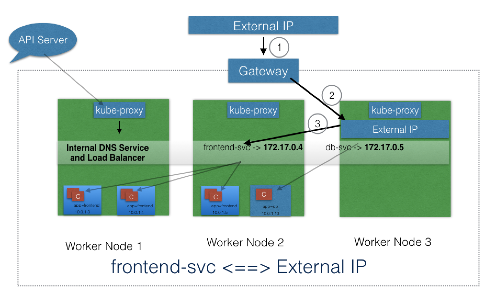

## Ch1. Container Orchestration

### Learning Objectives

- Define the concept of container orchestration.
- Explain the reasons for doing container orchestration.
	- Can not provision underlying architecture.
- Discuss different container orchestration options.
- Discuss different container orchestration deployment options.

## Ch2. Kubernetes

### Define Kubernetes.

"Kubernetes is an open-source system for automating deployment, scaling, and management of containerized applications."

- k8s
- based on Google's Borg
	- API Servers
	- Pods
	- IP-per-Pod
	- Services
	- Labels
- Written in Go
- [Apache License Version 2.0](https://www.apache.org/licenses/LICENSE-2.0)
- Google => CNCF July 2015

### Explain the reasons for using Kubernetes.

### Discuss the features of Kubernetes.

- Automatic binpacking
	- Kubernetes automatically schedules the containers based on resource usage - and constraints, without sacrificing the availability.
- Self-healing
	- Kubernetes automatically replaces and reschedules the containers from failed nodes. It also kills and restarts the containers which do not respond to health checks, based on existing rules/policy.
- Horizontal scaling
	- Kubernetes can automatically scale applications based on resource usage like CPU and memory. In some cases, it also supports dynamic scaling based on customer metrics.
- Service discovery and Load balancing
	- Kubernetes groups sets of containers and refers to them via a Domain Name System (DNS). This DNS is also called a Kubernetes service. Kubernetes can discover these services automatically, and load-balance requests between - containers of a given service.
- Automated rollouts and rollbacks
	- Kubernetes can roll out and roll back new versions/configurations of an application, without introducing any downtime.
- Secrets and configuration management
	- Kubernetes can manage secrets and configuration details for an application without re-building the respective images. With secrets, we can share confidential information to our application without exposing it to the stack configuration, like on GitHub.
- Storage orchestration
	- With Kubernetes and its plugins, we can automatically mount local, external, and storage solutions to the containers in a seamless manner, based on software-defined storage (SDS).
- Batch execution
	- Besides long running jobs, Kubernetes also supports batch execution.

### Discuss the evolution of Kubernetes from Borg.

### Explain what the Cloud Native Computing Foundation does.

- One of the projects hosted by [The Linux Foundation](https://www.linuxfoundation.org/)
- CNCF hosts a set of projects, with more to be added in the future. CNCF provides resources to each of the projects, but, at the same time, each project continues to operate independently under its pre-existing governance structure and with its existing maintainers.
	- [containerd](http://containerd.io/) for container runtime
	- [rkt](https://github.com/rkt/rkt) for container runtime
	- [Kubernetes](https://kubernetes.io/) for container orchestration
	- [Linkerd](https://linkerd.io/) for service mesh
	- [Envoy](https://github.com/envoyproxy/envoy) for service mesh
	- [gRPC](http://www.grpc.io/) for remote procedure call (RPC)
	- [Container](https://github.com/containernetworking/cni) Network Interface (CNI) for networking API
	- [CoreDNS](https://coredns.io/) for service discovery
	- [Rook](https://github.com/rook/rook) for cloud-native storage
	- [Notary](https://github.com/theupdateframework/notary) for security
	- [The Update Framework](https://github.com/theupdateframework/specification) (TUF) for software updates
	- [Prometheus](https://prometheus.io/) for monitoring
	- [OpenTracing](http://opentracing.io/) for tracing
	- [Jaeger](https://github.com/jaegertracing/jaeger) for distributed tracing
	- [Fluentd](http://www.fluentd.org/) for logging
	- [Vitess](http://vitess.io/) for storage.

For Kubernetes, the Cloud Native Computing Foundation:

- Provides a neutral home for the Kubernetes trademark and enforces proper usage
- Provides license scanning of core and vendored code
- Offers legal guidance on patent and copyright issues
- Creates open source [curriculum](https://github.com/cncf/curriculum), [training](https://training.linuxfoundation.org/linux-courses/system-administration-training/kubernetes-fundamentals), and [certification](https://www.cncf.io/certification/expert/)
- Manages a software conformance [working group](https://ponymail.cncf.io/thread.html/Zaw9xi4cg7fx9v6)
- Actively markets Kubernetes
- Hosts and funds developer marketing activities like [K8Sport](http://k8sport.org/)
- Supports ad hoc activities
- Funds conferences and meetup events.

## Ch3. Kubernets Architecture

Terms:

- master
- worker nodes
- etcd
- Container Network Interface (CNI)

### Discuss the Kubernetes architecture.

- 1+ Master Nodes
- 1+ Worker Nodes
- Distributed key-value store, like **etcd**



- If multiple Masters - only one in HA (High Availibility) mode.
- All Master nodes connect to **etcd**
	- **etcd** is a distributed key-value store.
		- KV store can be on Master, or separate with Master-KV connection.

### Explain the different components for master and worker nodes.

#### Master

##### API server

- accepts REST commands
- validates & processes commands
- After execution, state of cluster stored in distributed KV store.

##### Scheduler

- schedules work to different worker nodes.
- resource usage information for each worker node.
- knows of user/operator-set constraints
- considers:
	- quality of the service requirements
	- data locality
	- affinity
	- anti-affinity
	- etc
- schedules in terms of Pods and Services.

##### Controller Manager

- manages non-termination control loops which regulate Kubernetes cluster state.
- Each control loop knows desired state of objects under management, watches state through API server.
- If current state != desired state then it corrects

##### etcd

- distributed KV store
- stores cluster state

#### Worker

- VM/Physical/etc running applications using Pods.
- Controlled by Master node.
- Pod is scheduling unit in k8s.
- Pod is logical connection of 1+ containers which are always scheduled together.




##### Container runtime.

- Ex: [containerd](https://containerd.io/); [rkt](https://coreos.com/rkt/); [lxd](https://linuxcontainers.org/lxd/)
- Docker is a platform which uses **containerd** as a container runtime.

##### kubelet

- on each worker node - communicates with master node
- receives Pod definition (primarily thru API server)
- runs containers associated with Pod; keeps containers healthy
- connects to container runtime using [Container Runtime Interface](https://github.com/kubernetes/community/blob/master/contributors/devel/container-runtime-interface.md) (CRI)
	- CRI consists of protocol buffers, gRPC API, libraries

- 

- kubelet (grpc client) connects to CRI shim (grpc server) - performs container/image operations.
- CRI two services:
	- **ImageService**
		- image-related operations.
	- **RuntimeService**
		- Pod & container-related operations.
	- CRI allows k8s to use different container runtimes without need to recompile.
	- CRI Shims
		- dockershim
			- containers created using Docker installed on worker nodes. Docker uses containerd to create/manage containers.
		

		- cri-containerd
			- containerd directly - no Docker.
		

		- CRI-O	
			- enables using Open Container Initiative (OCI) compatibile runtimes.
			- supports runC & Clear Containers
			- Any OCI-compliant runtime can be plugged-in.
		

##### kube-proxy

- **Services** group related Pods & load balances to them.
- network proxy on worker node
- listens to API server for Service endpoint creation/deletion.
- For each Service endpoint:
    - kube-proxy sets up the routes

### Discuss about cluster state management with etcd.

- Stores cluster state.
- **etcd** is distributed Key-Value store based on [Raft Concensus Algorithm](https://web.stanford.edu/~ouster/cgi-bin/papers/raft-atc14)
    - collection of machines work as group to survive failure of some members.
    - one node will be master, rest followers. Any node can be treated as master.
    - written in Go
    - stores config details:
        - subnets; ConfigMaps; secrets; etc



### Review the Kubernetes network setup requirements.

- A unique IP is assigned to each Pod
    - Two Primary Specifications:
        - Container Network Model (CNM) - Docker
        - Container Network Interface (CNI) - CoreOS
    - **k8s uses CNI**
    
    - container runtime relies on CNI for IP assignment.
    - CNI connects to underlying configured plugin (Bridge or MACvlan) to get IPs.
    - Plugin passes IPs to CNI which passes IP back to container runtime.

- Containers in a Pod can communicate to each other
- The Pod is able to communicate with other Pods in the cluster
- If configured, the application deployed inside a Pod is accessible from the external world.
- Container runtime creates isolated network for each container that it starts: **network namespace**
    - Can be shared across Containers or Host OS.
- Inside Pod - containers share **network namespace** - can reach each other via localhost.

` `

- Pod-to-Pod Communication Across Nodes
    - Pods scheduled on any node.
    - Pods need to communicate across nodes - all nodes should be able to reach any Pod.
    - k8s ideal constraint: No Network Address Translation (NAT) during Pod-to-Pod communication across hosts
    - ^^ Achieved:
        - Routable Pods and nodes - uses underlying physical infrastructure like Google Kubernetes Engine.
        - Software Defined Networking ([Flannel](https://coreos.com/flannel/docs/latest/); [Weave](https://www.weave.works/oss/net/); [Calico](https://www.projectcalico.org/); etc)
    - [Kubernetes Cluster Networking documentation](https://kubernetes.io/docs/concepts/cluster-administration/networking/)

## Ch.4 Installing Kubernetes

### Discuss about the different Kubernetes configuration options.

#### All-in-One Single-Node Installation

With all-in-one, all the master and worker components are installed on a single node. This is very useful for learning, development, and testing. This type should not be used in production. Minikube is one such example, and we are going to explore it in future chapters.

#### Single-Node etcd, Single-Master, and Multi-Worker Installation

In this setup, we have a single master node, which also runs a single-node etcd instance. Multiple worker nodes are connected to the master node.

#### Single-Node etcd, Multi-Master, and Multi-Worker Installation

In this setup, we have multiple master nodes, which work in an HA mode, but we have a single-node etcd instance. Multiple worker nodes are connected to the master nodes.

#### Multi-Node etcd, Multi-Master, and Multi-Worker Installation

In this mode, etcd is configured in a clustered mode, outside the Kubernetes cluster, and the nodes connect to it. The master nodes are all configured in an HA mode, connecting to multiple worker nodes. This is the most advanced and recommended production setup.

### Discuss infrastructure considerations before installing Kubernetes.

- Should we set up Kubernetes on bare metal, public cloud, or private cloud?
- Which underlying system should we use? Should we choose RHEL, CoreOS, CentOS, or something else?
- Which networking solution should we use?
- etc

[Choosing the right solution](https://kubernetes.io/docs/setup/pick-right-solution/)


### Discuss infrastructure choices for a Kubernetes deployment.

#### Localhost Installation

- [Minikube](https://kubernetes.io/docs/getting-started-guides/minikube/)
- [Ubuntu on LXD](https://kubernetes.io/docs/getting-started-guides/ubuntu/local/)

#### On-Premise Installation

- On-Premise VMs
    - k8s installed on VMs
    - use Vagrant, VMware vSphere, KVM, etc
    - Automate: [Ansible](https://www.ansible.com/) / [kubeadm](https://github.com/kubernetes/kubeadm)
- On-Premise Bare Metal
    - on top of OS
        - RHEL, CoreOS, Fedora, Ubuntu, etc

#### Cloud Installation

##### Hosted Solutions

- [Google Kubernetes Engine (GKE)](https://cloud.google.com/container-engine/)
- [Azure Container Service (AKS)](https://azure.microsoft.com/en-us/services/container-service/)
- [Amazon Elastic Container Service for k8s (EKS) - Currently in Tech Preview](https://aws.amazon.com/eks/)
- [OpenShift Dedicated](https://www.openshift.com/dedicated/)
- [Platform9](https://platform9.com/support/kubernetes-at-the-command-line-up-and-running-with-kubectl/)
- [IBM Cloud Container Service](https://console.ng.bluemix.net/docs/containers/container_index.html)

##### Turnkey Cloud Solutions

- [Google Compute Engine](https://kubernetes.io/docs/getting-started-guides/gce/)
- [Amazon AWS](https://kubernetes.io/docs/getting-started-guides/aws/)
- [Microsoft Azure](https://kubernetes.io/docs/getting-started-guides/azure/)
- [Tectonic by CoreOS](https://coreos.com/tectonic)

##### Bare Metal

- Various Cloud providers allow Bare Metal installations.

### Review Kubernetes installation tools and resources.

#### [kubeadm](https://github.com/kubernetes/kubeadm) 

- first-class citizen in k8s ecosystem. 
- secure/recommended bootstrap of k8s.
- Contains building blocks to setup cluster.
- Easily extendable to add functionality.
- Does not provision machines

#### [KubeSpray](https://github.com/kubernetes-incubator/kubespray)

- (formerly name: Kargo)
- Purpose: Install Highly Available k8s cluster on:
    - AWS, GCE, Azure, OpenStack, bare metal.
- based on Ansible.
- Available on most Linux distributions.
- [Kubernets Incubator Project](https://github.com/kubernetes-incubator/kargo)

#### [Kops](https://github.com/kubernetes/kops)

- Create/Destroy/Upgrade/Maintain production-grade, HA, k8s clusters from CLI.
- Can provision machines.
- AWS officially supported.
- GCE / VMware vSphere in alpha stage.
- ++platforms for future.
<!-- TODO(Wes): Still true? -->

[Install k8s from scratch](https://kubernetes.io/docs/getting-started-guides/scratch/)

[Kubernetes The Hard Way](https://github.com/kelseyhightower/kubernetes-the-hard-way)

## Ch.5 Setting Up a Single-Node k8s Cluster with Minikube

### Discuss Minikube.

- runsin VM on Linux/Mac/Windows.
- Requirements:
    - [kubectl](https://kubernetes.io/docs/tasks/tools/install-kubectl/)
        - binary used to access k8s cluster.
        - Minikube requires **kubectl** installation to operate, but not to install.
    - On Linux:
        - [VirtualBox](https://www.virtualbox.org/wiki/Downloads) or [KVM](https://github.com/kubernetes/minikube/blob/master/docs/drivers.md#kvm-driver) hypervisors.
    - On macOS:
        - [Hyperkit driver](https://github.com/kubernetes/minikube/blob/master/docs/drivers.md#hyperkit-driver), [xhyve driver](https://github.com/kubernetes/minikube/blob/master/docs/drivers.md#xhyve-driver), [VirtualBox](https://www.virtualbox.org/wiki/Downloads), or [VMware Fusion](http://www.vmware.com/products/fusion.html) hypervisors.
    - On Windows:
        - [VirtualBox](https://www.virtualbox.org/wiki/Downloads) / [Hyper-V](https://github.com/kubernetes/minikube/blob/master/docs/drivers.md#hyperV-driver) hypervisors.
    - VT-x/AMD-v virtualization enabled in BIOS.
    - Internet access on first run.

### Install Minikube on Linux, Mac, and Windows.

Start Here: [Github Installation directions](https://github.com/kubernetes/minikube).

#### Linux

```bash
# Install VirtualBox
sudo apt-get install virtualbox
# Install Minikube
curl -Lo minikube https://storage.googleapis.com/minikube/releases/v0.25.0/minikube-linux-amd64 && chmod +x minikube && sudo mv minikube /usr/local/bin/
# Validate Minikube installation
minikube start
minikube status
minikube stop
```
#### Mac

Install [VirtualBox](http://download.virtualbox.org/virtualbox/5.1.22/VirtualBox-5.1.22-115126-OSX.dmg) on macOS

```bash
# Install Minikube
curl -Lo minikube https://storage.googleapis.com/minikube/releases/v0.25.0/minikube-darwin-amd64 && chmod +x minikube && sudo mv minikube /usr/local/bin/
# Validate Minikube installation
minikube start
minikube status
minikube stop
```

#### Windows

- Install [VirtualBox](http://download.virtualbox.org/virtualbox/5.1.22/VirtualBox-5.1.22-115126-Win.exe)

    - Disable Hyper-V
    - Windows support experimental

- Download the [Minikube binary](https://github.com/kubernetes/minikube/releases/download/v0.20.0/minikube-windows-amd64.exe) from the **Distribution** section.

    - Add Minikube binary to $PATH.

- Set default VM driver for Minikube

```powershell
PS C:\Windows\system32> minikube config set vm-driver virtualbox
# These changes will take effect upon a minikube delete and then a minikube start
```

- Validate Installation

```powershell
PS C:\WINDOWS\system32> minikube start
PS C:\WINDOWS\system32> minikube status
PS C:\WINDOWS\system32> minikube stop
```

## Ch.6 Accessing Minikube

### Review methods to access any Kubernetes cluster.

#### Command Line Interface (CLI)

- kubectl

#### Graphical User Interface (GUI)

- Kubernetes dashboard

#### APIs.



- Three independent groups:
    - **Core Group (/api/v1)**
        - Pods, Services, nodes, etc
    - **Named Group**
        - objects in **/apis/$NAME/$VERSION** format
        - API versions imply levels of stability/support:
            - Alpha - may be dropped @ any point in time, without notice.
                - Ex: **/apis/batch/v2alpha1**
            - Beta - well-tested; semantics of objects may change
                - Ex: **/apis/certificates.k8s.io/v1beta1**
            - Stable - appears in released software for many versions
                - Ex: **/apis/networking.k8s.io/v1**
    - **System-wide**
        - system-wide API endpoints
            - Ex: **/healthz** ; **/logs** ; **/metrcs** ; **/ui** ; etc

### Configure kubectl for Linux, macOS, and Windows.

#### Linux

```bash
# Download latest stable kubectl binary
curl -LO https://storage.googleapis.com/kubernetes-release/release/$(curl -s https://storage.googleapis.com/kubernetes-release/release/stable.txt)/bin/linux/amd64/kubectl

# Make kubectl executable
chmod +x ./kubectl

# Move into PATH
sudo mv ./kubectl /usr/local/bin/kubectl
```

#### macOS

```bash
# Download latest stable kubectl binary
curl -LO https://storage.googleapis.com/kubernetes-release/release/$(curl -s https://storage.googleapis.com/kubernetes-release/release/stable.txt)/bin/darwin/amd64/kubectl

# Make kubectl executable
chmod +x ./kubectl

# Move into PATH
sudo mv ./kubectl /usr/local/bin/kubectl
```

**OR** using Brew:

```bash
brew install kubectl
```

#### Windows

- [DL latest kubectl release](https://storage.googleapis.com/kubernetes-release/release/stable.txt)

- Depending on latest release, DL kubectl binary

```bash
# Example download 1.9.3
curl -LO https://storage.googleapis.com/kubernetes-release/release/v1.9.3/bin/windows/amd64/kubectl.exe`
```

- Once downloaded - move kubectl binary to PATH


### Access the Minikube dashboard.

```bash
minikube dashboard
```

**or**

```bash
kubectl proxy
```
- **kubectl** authenticates with API server on Master node
- Makes dashboard available @ [http://127.0.0.1:8001/api/v1/namespaces/kube-system/services/kubernetes-dashboard:/proxy/#!/overview?namespace=default](http://127.0.0.1:8001/api/v1/namespaces/kube-system/services/kubernetes-dashboard:/proxy/#!/overview?namespace=default)
- **kubernetes-dashboard** service runs inside **kube-system** namespace.

### Access Minikube via APIs.

#### With `kubectl proxy`

```bash
kubectl proxy
```
In a new session:
```bash
curl http://localhost:8001
```

#### Without `kubectl proxy`

- Use **Bearer Token** & **kubectl**
    - Def: **access token** generated by authentication server (API server on master node) and given to client


```bash
# Acquire Token
TOKEN=$(kubectl describe secret -n kube-system $(kubectl get secrets -n kube-system | grep default | cut -f1 -d ' ') | grep -E '^token' | cut -f2 -d':' | tr -d '\t' | tr -d " ")

# Retrieve API server endpoint
APISERVER=$(kubectl config view | grep https | cut -f 2- -d ":" | tr -d " ")

# Access API Server using curl
curl $APISERVER --header "Authorization: Bearer $TOKEN" --insecure
```
## Ch.7 Kubernetes Building Blocks

### Review the Kubernetes object model.

- Object Model:
    - what containerized apps are running on each node
    - app resource consumption
    - Policies attached to app (restart/upgrade, fault tolerance, etc)

- For each Object:
    - dcl desired state using **spec** field.
    - k8s manages **status** field for objects - state of object.
    - k8s Control Plane always attempting to match desired state with actual state.

- Ex Objects:
    - Pods, ReplicaSets, Deployments, Namespaces, etc

- To create Objects:
    - Provide **spec** field to k8s API server.
    - **spec** describes desired state & basic info (name, etc)
        - JSON format
    - usually define object's definition in .yaml file
        - **kubectl** converts to JSON payload and sends to API server.

TODO(Wes): Reduce
    > With the apiVersion field in the example above, we mention the API endpoint on the API server which we want to connect to. With the kind field, we mention the object type - in our case, we have Deployment. With the metadata field, we attach the basic information to objects, like the name. You may have noticed that in our example we have two spec fields (spec and spec.template.spec). With spec, we define the desired state of the deployment. In our example, we want to make sure that, at any point in time, at least 3 Pods are running, which are created using the Pods Template defined in spec.template. In spec.template.spec, we define the desired state of the Pod. Here, our Pod would be created using nginx:1.7.9.

### Discuss Labels and Selectors.

- **Labels**
    - key-value pairs attached to k8s objects (e.g. Pods).
    - organize & subset objects
    - many objects -to- one label
    - labels != unique to object


- Above Labels:
    - **app** / **env**

- **Label Selectors**
    - Equality-Based
        - filter objects on Label keys and values
        - `=`, `==`, `!=` operators
        - Ex: **env==dev**
    - Set-Based
        - filter objects on set of values
        - `in`, `notin`, `exists` operators
        - Ex: **env in (dev, qa)**


### Discuss Kubernetes building blocks

#### Pods

- smallest k8s object.
- unit of deployment in k8s
- represents single instance of the app
- Pod is logical collection of 1+ containers, which:
    - Are scheduled together on the same host
    - Share the same network namespace
    - Mount the same external storage (volumes).


- Ephemeral; 
- can not self-heal
    - use with controllers
        - handle Pod's replication, fault tolerance, self-heal, etc
- Controller Ex:
    - Deployments, ReplicaSets, ReplicationControllers, etc
- Pod Templates
    - attach Pod's specificiation to other objects


#### **[ReplicationController (rc)](https://kubernetes.io/docs/concepts/workloads/controllers/replicationcontroller/)**

- part of master node's controller manager.
- assures specified # replicas for Pod are running.
- controllers like **rc** always used to create/manage Pods.
- only supports equality-based Selectors.

#### [ReplicaSets](https://kubernetes.io/docs/concepts/workloads/controllers/replicaset/)

- next generation ReplicationController
- support both equality- and set-based selectors


One Pod dies, current state != desired state


ReplicaSet detects; creates Pod


ReplicaSets can be independent; mostly used by Deployments to orchestrate Pod creation, deletion, updates.  Deployment automatically creates ReplicaSets.

#### [Deployments](https://kubernetes.io/docs/concepts/workloads/controllers/deployment/)

- object
- provides declarative updates to Pods and ReplicaSets.
- DeploymentController part of master node's controller manager.
- assures curret state == desired state.
- feature: **Deployment recording** (deployments explained below)
    - if something goes wrong - rollback to previous state


Below graphic:

- **Deployment** creates **ReplicaSet A**.
- **ReplicaSet A** creates **3 Pods**.
- Each Pod - one container uses **nginx:1.7.9**.


Next graphic:

- in Deployment
    - we change Pods Template & update image for **nginx** container to **nginx:1.9.1**.
    - Pod Template modified: new **ReplicaSet B** created.
    - process referred to as **Deployment rollout**.
        - rollout only triggered on Pods Template update for deployment.
    - Scaling operations do not trigger deployment.


Next graphic:

- When **ReplicaSet B** ready:
    - Deployment points to it.


#### [Namespaces](https://kubernetes.io/docs/concepts/overview/working-with-objects/namespaces/)

- partitions k8s cluster.
- Ex: numerous users - organize into teams/projects.
- names of resources/objects created in **Namespace** are unique, but not across **Namespaces**.

List all **Namespaces**:
```bash
$ kubectl get namespaces
NAME          STATUS       AGE
default       Active       11h
kube-public   Active       11h
kube-system   Active       11h
```

- k8s creates 2 default Namespaces:
    - **kube-system** 
        - objects created by k8s system.
    - **default**
        - objects from any other Namespace.
- by default, we connect to **default** Namespace.
- **kube-public**
    - readable by all users.
    - used for special purposes (Ex: bootstrapping a cluster).
- [Resource Quotas](https://kubernetes.io/docs/concepts/policy/resource-quotas/)
    - divide cluster resources within Namespaces.

## Ch.8 Authentication, Authorization, Admission Control

Objective: 

- Discuss authentication, authorization, and access control stages of the Kubernetes API access.
- Understand the different kinds of Kubernetes users.
- Discuss the different modules for authentication and authorization.

### Stages of k8s API access 

#### Authentication
Logs in user.

- k8s does not have object *user*, or store *usernames*.
- k8s can use usernames for access control and request logging.
- Two kinds of users:
    - **Normal Users**
        - Managed outside k8s cluster
            - via independent services, Ex:
                - User/Client Certificates
                - file listing usernames/passwords
                - Google accounts
                - etc
    - **Service Accounts**
        - in-cluster processes communicate with API server to perform operations.
        - Most Service Account users auto-created via API server
        - Can also create manually
        - Service Account users tied to given Namespace
            - mounts respective credentials to communicate with API server as Secrets.

##### [Authentication Modules](https://kubernetes.io/docs/admin/authentication/#authentication-strategies)

- Overview:
    - Multiple authenticators can be enabled
    - first module to successfully authenticate request short-circuits the evaluation.
    - to be successful - enable at least 2 methods:
        - service account tokens authenticator
        - user authenticator
    - k8s also supports **anonymous requests**, if configured

- **Client Certificates**
    - enable w/reference to file w/1+ cert authorities
        - pass `--client-ca-file=SOMEFILE` option to API server.
        - cert auths in file validate client certs presented to API server.
        - Demo Video: <!-- TODO(Wes): Add video -->
- **Static Token File**
    - pass file w/pre-defined bearer tokens 
        - pass with `--token-auth-file=SOMEFILE` option to API server.
        - these tokens last indefinitely.
        - cannot change w/o restarting API server
- **Bootstrap Tokens**
    - alpha; used in bootstrapping new k8s cluster.
- **Static Password File**
    - pass file w/basic authentication details
        - pass w/ `--basic-auth-file=SOMEFILE` option to API server.
        - lasts indefinitely
        - change w/API server restart
- **Service Account Tokens**
    - auto-enabled authenticator
    - uses signed bearer tokens to verify requests
    - tokens attached to Pods using **ServiceAccount Admission Controller**.
        - allows in-cluster processes to talk to API server.
- **OpenID Connect Tokens**
    - connect with OAuth 2 providers
        - Ex: Azure Active Directory, Salesforce, Google, etc
- **Webhook Token Authentication**
    - verification of bearer tokens offloaded to remote servce.
- **Keystone Password**
    - pass `--experimental-keystone-url=<AuthURL>` option to API Server.
        - **AuthURL** is Keystone server endpoint.
- **Authenticating Proxy**
    - used to program additional authentication logic


#### Authorization
    
Authorizes API requests.

- After Authentication, users send API requests to perform operations.
- API requests are Authorized
- API request attributes authorized:
    - user, group extra, Resource, Namespace, etc
    - these attributes evaluated against policies.
    - if evalualtion success - request allowed; otherwise denied.
- Multiple Authorization modules/authorizers.
- 1+ module can be configured for k8s cluster
    - each module checked in sequence
    - if **any** authorizer approves/denies - that decision is returned immediately.

##### Authorization Modules

- **Node Authorizer**
    - authorizes API requests from kubelets
    - authorizes kubelet's:
        - read operations for services, endpoints, nodes, etc
        - write operators for nodes, pods, events, etc
    - [Kubernetes documentation](https://kubernetes.io/docs/admin/authorization/node/)
- **Attribute-Based Access Control (ABAC) Authorizer**
    - k8s grants access to API requests - combine policies with attributes.
    - Ex: user *nkhare* can only read Pods in Namespace **lfs158**:
    ```bash
    {
      "apiVersion": "abac.authorization.kubernetes.io/v1beta1",
      "kind": "Policy",
      "spec": {
        "user": "nkhare",
        "namespace": "lfs158",
        "resource": "pods",
        "readonly": true
      }
    }
    ```
    - enable w/`--authorization-mode=ABAC` option to API server.
        - specify authorization policy: `--authorization-policy-file=PolicyFile.json`
    - [Kubernetes documentation](https://kubernetes.io/docs/admin/authorization/abac/)
- **Webhook Authorizer**
    - k8s offers authorization decisions to 3rd-party services
    - enable: `--authorization-webhook-config-file=SOME_FILENAME`
        - SOME_FILENAME: config of remote authorization service
    - [Kubernetes documentation](https://kubernetes.io/docs/admin/authorization/webhook/)
- **Role-Based Access Control (RBAC) Authorizer**
    - regulate access to resources based on user assigned roles
        - roles: users, service accounts, etc
    - enable: `--authorization-mode=RBAC` to API server.
    - [Kubernetes documentation](https://kubernetes.io/docs/admin/authorization/rbac/)
    - roles assigned operations:
        - **create**, **get**, **update**, **patch**, etc
        - operations known as "verbs"
    - Two kids of roles:
        - **Role**
            - grant access to resource within specific Namespace
            ```bash
            kind: Role
            apiVersion: rbac.authorization.k8s.io/v1
            metadata:
              namespace: lfs158
              name: pod-reader
            rules:
            - apiGroups: [""] # "" indicates the core API group
              resources: ["pods"]
              verbs: ["get", "watch", "list"]
            ```
            - creates **pod-reader** role
                - access only to Pods of **lfs158** Namespace.
        - **ClusterRole**
            - grany access to resource with cluster-wide scope
        - Once **Role** is created - bind users with *RoleBinding*
            - *RoleBinding*
                - bind users to same namespace as a Role.
                ```bash
                kind: RoleBinding
                apiVersion: rbac.authorization.k8s.io/v1
                metadata:
                  name: pod-read-access
                  namespace: lfs158
                subjects:
                - kind: User
                  name: nkhare
                  apiGroup: rbac.authorization.k8s.io
                roleRef:
                  kind: Role
                  name: pod-reader
                  apiGroup: rbac.authorization.k8s.io
                ```
                - user *nkhare* access to read Pods of **lfs158** Namespace.
            - *ClusterRoleBinding*
                - grant access to resources @ cluster-level and to all Namespaces.

#### Admission Control

Modules which modify/reject requests based on additional checks:

- Ex: **Quota**


- Granular access control policies
    - allowing privledged containers, checking resource quota, etc
    - Resource Controllers:
        - ResourceQuota, AlwaysAdmit, DefaultStorageClass, etc
        - in effect only after API requests authenticated/authorized

- enable admission controls:
    - start k8s API server w/**admission-control**
    - takes comma-delimited, ordered list of controller names
    - `--admission-control=NamespaceLifecyl,ResourceQuota,PodSecurityPolicy,DefaultStorageClass`
    - [Kubernetes documentation](https://kubernetes.io/docs/admin/admission-controllers/#defaultstorageclass)

## Ch.9 Services

### Objective:

- Discuss the benefits of grouping Pods into Services to access an application.
- Explain the role of the kube-proxy daemon running on each worker node.
- Explore the Service discovery options available in Kubernetes.
- Discuss different Service types.

### Connecting Users to Pods

- IP's assigned dynamically - Pods are ephemeral.


User/Client connected Pod dies - new Pod created. New Pod - New IP.


k8s provides **[Services](https://kubernetes.io/docs/concepts/services-networking/service/)** 

- higher level abstraction than IP.
- groups Pods and policy to access them.
- grouping via **Labels** and **Selectors**.

### Services

- **app** keyword as Label.
- **frontend** & **db** values for Pods


- Selectors (**app==frontend** & **app==db**)
- groups into 2 logical groups:
    - 1 w/3 Pods
    - 1 w/1 Pod
- assign name to logical grouping: **Service name**.
- Ex:
    - Two Services:
        - **frontend-svc**
            - selector: **app==frontend**
        - **db-svc**
            - selector: **app==db**


#### Service Object Example

```bash
kind: Service
apiVersion: v1
metadata:
  name: frontend-svc
spec:
  selector:
    app: frontend
  ports:
    - protocol: TCP
      port: 80
      targetPort: 5000
```

Explain:

- Service: **frontend-svc**
- Selects Pods w/Label **app==frontend**
- Each Service receives IP address by default
    - routable only inside cluster
    - In Example:
        - **172.17.0.4** for **frontend-svc** Service
        - **172.17.0.5** for **db-svc** Service
    - IP address attached to Service known as ClusterIP for that Service.


- User/Client connects to service via IP.
- Service forwards traffic to one of attached Pods.
    - Service load balances while selecting the Pods for forwarding.
    - can select Port to forward
        - Ex: 
            - **frontend-svc** receives requests from user/client on Port **80**.
            - **frontend-svc** forwards to Pod on Port **5000**.
    - If no port designated:
        - Service forwards on same port received
- **Service endpoint**
    - tuple of Pods, IP, targetPort
    - Ex:
        - **frontend-svc** has 3 endpoints:
            - **10.0.1.3:5000**
            - **10.0.1.4:5000**
            - **10.0.1.5:5000**

### kube-proxy

- worker nodes run daemon called [kube-proxy](https://kubernetes.io/docs/concepts/services-networking/service/#virtual-ips-and-service-proxies)
    - watches API server on master node for addition/removal of Services/endpoints.
    - For each new Service, on each node, **kube-proxy** configures iptables to capture traffic for its ClusterIP & forwards to one of the endpoints.
    - When Service removed:
        - **kube-proxy** removes iptables rules on all nodes as well.


### Service Discovery

Two methods for discovering Services:

- **Environment Variables**
    - @Pod Start, **kubelet** daemon on node adds env variables in Pod for all active Services.
    - Ex:
        - Service: **redis-master**; 
        - exposes port **6379**
        - ClusterIP 172.17.0.6
        - then, new Pod:
        ```bash
        REDIS_MASTER_SERVICE_HOST=172.17.0.6
        REDIS_MASTER_SERVICE_PORT=6379
        REDIS_MASTER_PORT=tcp://172.17.0.6:6379
        REDIS_MASTER_PORT_6379_TCP=tcp://172.17.0.6:6379
        REDIS_MASTER_PORT_6379_TCP_PROTO=tcp
        REDIS_MASTER_PORT_6379_TCP_PORT=6379
        REDIS_MASTER_PORT_6379_TCP_ADDR=172.17.0.6
        ```
    - **Note**: Pods will not have env variables for Services created after Pod creation.
- **DNS**
    - most common; recommended.
    - [addon](https://github.com/kubernetes/kubernetes/blob/master/cluster/addons/README.md) for [DNS](https://github.com/kubernetes/kubernetes/tree/master/cluster/addons/dns).
    - creates DNS record for each Service
        - format: **my-svc.my-namespace.svc.cluster.local**
    - Services w/same Namespace can talk.
        - Ex:
            - Service: **redis-master** in **my-ns** Namespace.
            - All Pods in same Namespace can reach **redis** Service by using its name: **redis-master**
            - Pods from other Namespaces can reach **redis-master** Service, by:
                - Add respective Namespace as suffix: **redis-master.my-ns**.

### ServiceType

- Access scope decided by *ServiceType* - can be mentioned when creating Service.
    - Is the Service:
        - only accessible within the cluster?
        - accessible from within the cluster and the external world?
        - Maps to an external entity which resides outside the cluster?

#### ClusterIP

- default *ServiceType*
- Service receives Virtual IP using ClusterIP.
    - assigned IP used for communicating w/Service 
    - accessible only within Cluster.

#### NodePort

- in addition to creating ClusterIP:
    - port range 30000-32767 mapped to respective Service, from all worker nodes.
    - Ex:
        - mapped NodePort: **32233** for service **frontend-svc**
        - connect to any worker node on **32233**
        - node redirects all traffic to ClusterIP - **172.17.0.4**
- Default: 
    - when expose NodePort => random port auto-selected by k8s Master from range **30000-32767**.
    - can assign specific port to avoid dynamic port value while creating service.


- **NodePort** *ServiceType* can make Services accessible to external world.
    - end-user connects to worker nodes on specified port
    - worker node forwards traffic to apps running inside cluster.
    - admins can configure reverse proxy outside k8s cluster
        - map specific endpoint to respective port on worker nodes

#### LoadBalancer

- NodePort & ClusterIP Services automatically created
    - external load balancer will route to them
- Services exposed @ static port on each worker node
- Service exposed externally w/underlying cloud provider's load balance feature.



- **LoadBalancer** *ServiceType* only works if:
    - underlying IaaS supports automatic creation of Load Balancers
        - **and**
    - support in k8s (GCP/AWS)

#### ExternalIP

- Service mapped to **ExternalIP** if it can route to one or more worker nodes.
- Traffic ingressed with ExternalIP (as destination IP) on Service port is routed to one of the Service endpoints.



- Note: 
    - ExternalIPs not managed by k8s.
    - cluster admins configure routing to map ExternalIP address to one of the nodes.

#### ExternalName

- **ExternalName** special *ServiceType*
    - no Selectors
    - does not define any endpoints
    - when accessed within cluster:
        - returns **CNAME** record of externally configured Service.
- make externally configured Services (**my-database.example.com**) available inside cluster
    - requires just the name (like, **my-database**)
    - available inside same Namespace


